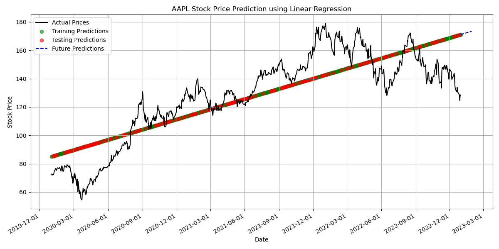

# 📈 Advanced Stock Prediction & Analysis Dashboard


A comprehensive platform for stock price analysis, prediction, and portfolio optimization using advanced machine learning algorithms and modern financial theory.

<p align="center">
  
</p>

## 📋 Table of Contents

- [Overview](#overview)
- [Key Features](#key-features)
- [Demo](#demo)
- [Installation](#installation)
- [Data Sources Configuration](#data-sources-configuration)
  - [Yahoo Finance](#yahoo-finance)
  - [Alpha Vantage API](#alpha-vantage-api)
  - [Financial Modeling Prep API](#financial-modeling-prep-api)
  - [Marketstack API](#marketstack-api)
- [Running the Application](#running-the-application)
- [Models & Algorithms](#models--algorithms)
- [Troubleshooting](#troubleshooting)
- [Project Structure](#project-structure)
- [Contributing](#contributing)
- [License](#license)
- [Acknowledgements](#acknowledgements)
- [Developer](#developer)

## 🔍 Overview

This project provides comprehensive tools for stock market analysis and prediction using various machine learning models. It combines technical analysis, fundamental data, and machine learning to offer insights and predictions for stock prices and portfolio optimization.

The dashboard integrates multiple data sources, resilient to API rate limits and service disruptions, to ensure reliable data availability for your analysis.

## ✨ Key Features

### Stock Price Analysis and Prediction
- **Historical Data Analysis**: Visualize and analyze historical price movements
- **Multiple Prediction Models**:
  - Linear Regression: Basic time-series forecasting
  - Advanced Model: Incorporates technical indicators
  - Ensemble Model: Combines multiple algorithms
  - LSTM Neural Networks: Deep learning for complex patterns
  - XGBoost: Gradient boosting for accurate predictions
  - Prophet: Time series forecasting for seasonal trends

### Technical Analysis
- **Interactive Technical Indicators**:
  - Moving Averages (Simple & Exponential)
  - Relative Strength Index (RSI)
  - Moving Average Convergence Divergence (MACD)
  - Bollinger Bands
  - Volume Analysis
  - Support and Resistance Levels

### Portfolio Optimization
- **Modern Portfolio Theory Implementation**:
  - Efficient Frontier Visualization
  - Maximum Sharpe Ratio Portfolio
  - Minimum Volatility Portfolio
  - Risk-Adjusted Returns
- **Advanced Risk Metrics**:
  - Value at Risk (VaR)
  - Expected Shortfall
  - Drawdown Analysis
  - Sortino Ratio

### Multi-Stock Comparison
- Side-by-side comparison of multiple stocks
- Correlation analysis
- Performance benchmarking
- Sector analysis

### Additional Features
- **Sentiment Analysis**: Incorporates news sentiment for enhanced predictions
- **Backtesting Framework**: Test strategies on historical data
- **Responsive Web Interface**: User-friendly dashboard with Streamlit
- **Multi-source Data Reliability**: Automatic failover between data providers

## 🎮 Demo

<p align="center">
  
</p>


## 🚀 Installation

### Prerequisites
- Python 3.7+
- Git (optional)

### Step-by-Step Installation

1. **Clone the repository or download the files**
   ```bash
   git clone https://github.com/yourusername/stock-prediction-dashboard.git
   cd stock-prediction-dashboard
   ```
   *Note: Adjust the repository URL if needed or download manually*

2. **Create a virtual environment (recommended)**
   ```bash
   python -m venv venv
   
   # Activate on Windows
   venv\Scripts\activate
   
   # Activate on macOS/Linux
   source venv/bin/activate
   ```

3. **Install required packages**
   ```bash
   pip install -r requirements.txt
   ```

4. **Run the diagnostic tool to verify everything is set up correctly**
   ```bash
   python diagnostic.py
   ```

5. **Configure API keys** (See [Data Sources Configuration](#data-sources-configuration) section)

## 🔑 Data Sources Configuration

The application uses multiple data sources with automatic failover in the following order:

1. Yahoo Finance (primary, no API key needed)
2. Financial Modeling Prep (first fallback, requires API key)
3. Alpha Vantage (second fallback, requires API key) 
4. Marketstack (third fallback, requires API key)
5. Pandas-datareader with Stooq (final fallback, no API key needed)

### Yahoo Finance
- No configuration required
- Rate limits apply but handled automatically with backoff strategies

### Financial Modeling Prep API
The application can use Financial Modeling Prep as a data source, providing real-time and historical price data, financial statements, and fundamentals for 70,000+ symbols.

1. Get a free API key from [Financial Modeling Prep](https://financialmodelingprep.com/developer/docs/)
2. Set the API key as an environment variable:

   **Windows:**
   ```
   set FMP_API_KEY=your_api_key_here
   ```

   **Linux/Mac:**
   ```
   export FMP_API_KEY=your_api_key_here
   ```

   **Python script (alternative):**
   ```python
   import os
   os.environ['FMP_API_KEY'] = 'your_api_key_here'
   ```

### Alpha Vantage API
The application can use Alpha Vantage as a reliable stock market data source.

1. Get a free API key from [Alpha Vantage](https://www.alphavantage.co/support/#api-key)
2. Set the API key as an environment variable:

   **Windows:**
   ```
   set ALPHA_VANTAGE_API_KEY=your_api_key_here
   ```

   **Linux/Mac:**
   ```
   export ALPHA_VANTAGE_API_KEY=your_api_key_here
   ```

   **Python script (alternative):**
   ```python
   import os
   os.environ['ALPHA_VANTAGE_API_KEY'] = 'your_api_key_here'
   ```

*Note: The free tier of Alpha Vantage API has a limit of 5 API calls per minute and 500 calls per day.*

### Marketstack API
The application can also use Marketstack for real-time and end-of-day data for 30,000+ tickers worldwide.

1. Get a free API key from [Marketstack](https://marketstack.com/product)
2. Set the API key as an environment variable:

   **Windows:**
   ```
   set MARKETSTACK_API_KEY=your_api_key_here
   ```

   **Linux/Mac:**
   ```
   export MARKETSTACK_API_KEY=your_api_key_here
   ```

   **Python script (alternative):**
   ```python
   import os
   os.environ['MARKETSTACK_API_KEY'] = 'your_api_key_here'
   ```

*Note: The free tier of Marketstack offers 100 requests per month.*

## ▶️ Running the Application

### Diagnostic Check
First, run the diagnostic tool to ensure everything is set up correctly:

```bash
python diagnostic.py
```

This will check:
- Required packages installation
- Data source connectivity
- Required directories
- Module accessibility

### Starting the Web Dashboard
To start the Streamlit dashboard:

```bash
streamlit run app.py
```

The application will open in your default web browser at `http://localhost:8501`.

## 🧠 Models & Algorithms

The application implements multiple prediction and analysis models:

### Linear Regression Model
- Basic time-series forecasting
- Date-based prediction of stock prices
- Baseline performance metrics

### Advanced Model
- Incorporates technical indicators
- Feature engineering with market signals
- Enhanced pattern recognition

### Ensemble Model
- Combines multiple algorithms
- Weighted predictions based on model performance
- Reduces individual model bias

### LSTM Neural Networks
- Deep learning for time series data
- Captures complex temporal patterns
- Memory of long-term dependencies

### XGBoost Model
- Gradient boosting for price prediction
- Feature importance analysis
- Handles non-linear relationships

### Prophet Model
- Facebook's time series forecasting tool
- Handles seasonality and holiday effects
- Robust to missing data

## ❓ Troubleshooting

If you encounter issues:

1. **Run the diagnostic script to identify problems**
   ```bash
   python diagnostic.py
   ```

2. **Check your internet connection**
   - The app requires internet access to download stock data
   - Some corporate networks may block financial data APIs

3. **Ensure all required directories exist**
   ```bash
   mkdir -p results/portfolio results/risk
   ```

4. **API Key Issues**
   - Verify your API keys are correctly set in environment variables
   - Check API usage limits (especially for free tiers)
   - Try with different data sources

5. **"NaN" or Empty Results**
   - Try with a different date range
   - Some tickers may not be available on all data sources
   - Check for sufficient historical data (technical indicators need enough history)

6. **Performance Issues**
   - Reduce the date range for faster processing
   - Limit the number of tickers in multi-stock comparison
   - Try disabling heavier models like LSTM if running on limited hardware

## 📂 Project Structure

```
.
├── app.py                  # Main Streamlit dashboard
├── diagnostic.py           # System diagnostic tool
├── requirements.txt        # Project dependencies
├── utils.py               # Utility functions and helpers
├── style.css              # Custom CSS styling
├── stock_prediction.py    # Linear regression model implementation
├── advanced_model.py      # Advanced prediction model
├── ensemble_model.py      # Ensemble model implementation
├── lstm_model.py          # LSTM neural network model
├── xgboost_model.py       # XGBoost implementation
├── prophet_model.py       # Prophet model implementation
├── portfolio_optimization.py # Portfolio optimization tools
├── backtesting.py         # Backtesting framework
├── sentiment_analysis.py  # News sentiment analysis
├── cache/                 # Cache directory for API responses
├── models/                # Saved model files
└── results/               # Analysis results and visualizations
    ├── portfolio/         # Portfolio optimization results
    └── risk/              # Risk assessment visualizations
```

## 🤝 Contributing

Contributions are welcome! Here's how you can contribute:

1. Fork the repository
2. Create a new branch (`git checkout -b feature/your-feature`)
3. Make your changes
4. Run tests and ensure all diagnostics pass
5. Commit your changes (`git commit -am 'Add new feature'`)
6. Push to the branch (`git push origin feature/your-feature`)
7. Create a Pull Request

For major changes, please open an issue first to discuss what you'd like to change.

## 👨‍💻 Developer

This project was developed by:

**Mohammed Saqhib**
- Email: msaqhib76@gmail.com
- Role: Lead Developer
- Portfolio: [View Portfolio](https://mohammed-saqhib.github.io/Portfolio/)
- LinkedIn: [Connect on LinkedIn](http://www.linkedin.com/in/mohammed-saqhib-87b8b325a)
- GitHub: [View GitHub Profile](https://github.com/Mohammed-Saqhib)

For questions, feedback, or collaboration opportunities, please feel free to reach out.

## 📄 License

This project is licensed under the MIT License - see the LICENSE file for details.

## 🙏 Acknowledgements

- [Yahoo Finance](https://finance.yahoo.com/) for providing financial data
- [Alpha Vantage](https://www.alphavantage.co/) for comprehensive market data
- [Financial Modeling Prep](https://financialmodelingprep.com/) for financial statements and price data
- [Marketstack](https://marketstack.com/) for global market data
- [Streamlit](https://streamlit.io/) for the interactive web framework
- [Scikit-learn](https://scikit-learn.org/) for machine learning tools
- [TensorFlow](https://www.tensorflow.org/) for deep learning capabilities
- [Matplotlib](https://matplotlib.org/) & [Plotly](https://plotly.com/) for visualization
- [Pandas](https://pandas.pydata.org/) for data manipulation

---

<p align="center">
  <b>Disclaimer:</b> This tool is for educational purposes only.<br>
  Stock predictions shown here should not be used as the sole basis for investment decisions.<br>
  Past performance is not indicative of future results, and all investments involve risk.
</p>
